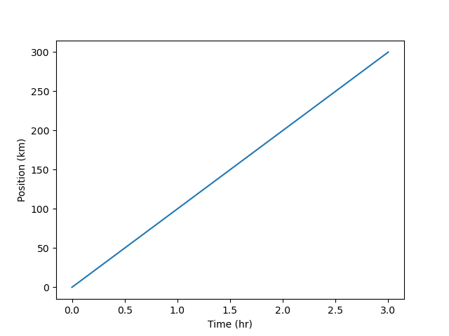
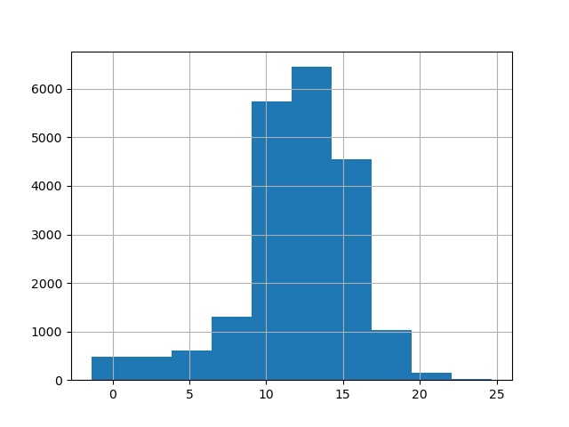
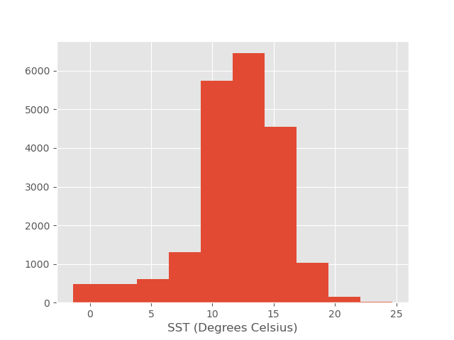
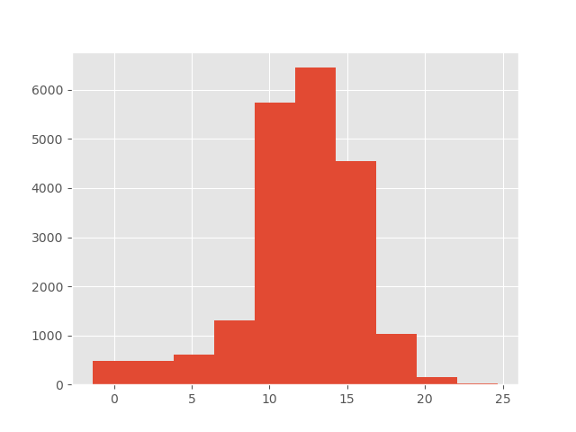
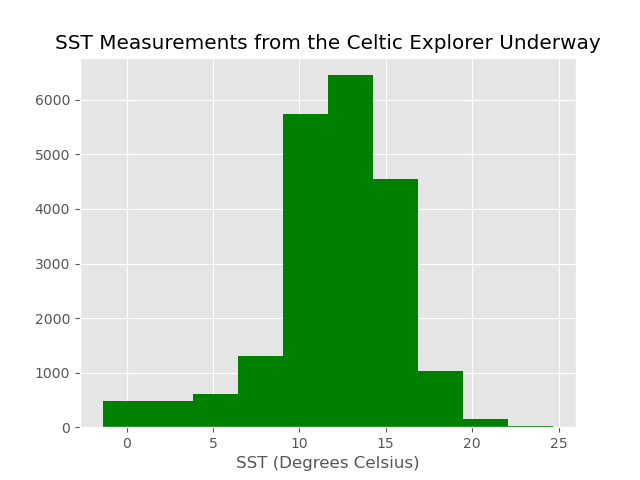

## Using a Library for Scientific Plotting

A library is a collection of code units (functions, classes, variables) which
implement a set of related tasks.
In Python, [`matplotlib`](https://matplotlib.org/) is the most widely used
library for scientific plotting.
We commonly use its `pyplot` module and import it as follows:

~~~
import matplotlib.pyplot as plt
~~~
{: .language-python}

In Python, a module is an object which contains Python code and which can be
imported inside another Python program.
Simple plots are then (fairly) simple to create:

~~~
time = [0, 1, 2, 3]
position = [0, 100, 200, 300]

plt.plot(time, position)
plt.xlabel('Time (hr)')
plt.ylabel('Position (km)')
~~~
{: .language-python}

The Jupyter notebook renders plots inline by default.

> ## Displaying All Open Figures
> 
> In our Jupyter notebook example, running the cell should generate the figure
> directly below the code. 
> However, other Python environments (such as an interactive Python session
> started from a terminal or a Python script executed via the command line)
> require an additional command to display the figure:
>
> ~~~
> plt.show()
> ~~~
> {: .language-python}
>
> This command can also be used within a notebook -- for instance, to display
> multiple figures if several are created by a single cell.
>
{: .callout}

## Plotting Data Directly from a Dataframe

In Python, [`pandas`](https://pandas.pydata.org/) is is the most widely used
library for data analysis and manipulation. Notably, it provides a very useful
data structure called a *dataframe*. Dataframes contain tabular data which
are:

* two-dimensional;
* potentially heterogeneous;
* with labelled axes (rows and columns).

To showcase the power and ease of use of `pandas`, let's try it on some
oceanographic open data:
https://data.gov.ie/dataset/celtic-explorer-underway
Navigate to "available as CSV" and right-click the "Download" button (to copy
the URL).

~~~
url = "http://atlas.marine.ie/midata/OceanFeatures/Celtic_Explorer_Underway.csv.zip"

import pandas as pd

df = pd.read_csv(url)
df.shape
~~~
{: .language-python}
~~~
(20845, 28)
~~~
{: .output}

What are the columns of this table?

~~~
df.columns
~~~
{: .language-python}
~~~
Index(['WKT', 'gml_id', 'OBJECTID', 'beginLifespanVersion',
       'endLifespanVersion', 'datasetName', 'localId', 'inspireId',
       'inspireTheme', 'version', 'description', 'longitude', 'latitude',
       'depth', 'depthUoM', 'value_', 'observedProperty',
       'observedPropertyUoM', 'resultQuality', 'resultTime', 'validTime',
       'process', 'scale', 'coordinateReferenceSystem',
       'styleLayerDescription', 'licence', 'dataProvenance', 'dataAccessUrl'],
      dtype='object')
~~~
{: .output}

We can access a given column using square brackets and the name (label) of
this column in quotes. Each column is a *series* of data:

~~~
type(df['value_'])
~~~
{: .language-python}
~~~
pandas.core.series.Series
~~~
{: .output}

What is this dataset about?

~~~
df['description'].unique()
~~~
{: .language-python}
~~~
array(['Underway SBE 21 thermosalinograph sea surface temperature station'],
      dtype=object)
~~~

This dataset contains values of sea surface temperature (SST):

~~~
df['observedProperty'].unique()
~~~
{: .language-python}
~~~
array(['http://vocab.nerc.ac.uk/collection/P07/current/CFSN0381/'],
      dtype=object)
~~~
{: .output}

We can plot them readily by calling `df['value_'].plot()`.
By default, this function plots the rows as the x-axis.

## Using Different Kinds of Plots

Many kinds of plots are available (see the
[official docs](https://pandas.pydata.org/docs/user_guide/visualization.html#other-plots)).
For example, we may want to know how the SST values are distributed.
We would then use a histogram:

~~~
# df['value_'].plot(kind='hist')
df['value_'].hist()
~~~
{: .language-python}

This implicitly uses `matplotlib.pyplot`.

## Styling Plots

Different styles are also available; to view them, run:

~~~
plt.style.available
~~~
{: .language-python}
~~~
['Solarize_Light2',
 '_classic_test_patch',
 '_mpl-gallery',
 '_mpl-gallery-nogrid',
 'bmh',
 'classic',
 'dark_background',
 'fast',
 'fivethirtyeight',
 'ggplot',
 'grayscale',
 'seaborn-v0_8',
 'seaborn-v0_8-bright',
 'seaborn-v0_8-colorblind',
 'seaborn-v0_8-dark',
 'seaborn-v0_8-dark-palette',
 'seaborn-v0_8-darkgrid',
 'seaborn-v0_8-deep',
 'seaborn-v0_8-muted',
 'seaborn-v0_8-notebook',
 'seaborn-v0_8-paper',
 'seaborn-v0_8-pastel',
 'seaborn-v0_8-poster',
 'seaborn-v0_8-talk',
 'seaborn-v0_8-ticks',
 'seaborn-v0_8-white',
 'seaborn-v0_8-whitegrid',
 'tableau-colorblind10']
~~~
{: .output}

~~~
plt.style.use('ggplot')
df['value_'].hist();
plt.xlabel('SST (Degrees Celsius)');
~~~
{: .language-python}

We have added semicolons to keep only the actual plot in the output.

Alternatively, we could call `matplotlib.pyplot`'s `plot` function explicitly:

~~~
plt.hist(df['value_']);
~~~
{: .language-python}

The colour can also be specified as an additional optional argument, e.g.,
`'b'` stands for blue:

~~~
df['value_'].hist(color='b');
~~~
{: .language-python}

> ## Changing Colours
>
> 1. Change the histogram above so it is green instead of blue.
> 2. (Re-)add a label for the x-axis (`xlabel`).
> 3. Add a title for the overall plot (`title`).
>
> > ## Solution
> >
> > ~~~
> > df['value_'].hist(color='g');
> > plt.xlabel('SST (Degrees Celsius)');
> > plt.title('SST Measurements from the Celtic Explorer Underway');
> > ~~~
> > {: .language-python}
> > 
> {: .solution}
{: .challenge}

> ## Saving your Plot to a File
> 
> If you are satisfied with the plot you see, you may want to save it to a
> file, perhaps to include it in a publication. There is a function in the
> `matplotlib.pyplot` module that accomplishes this:
> [savefig](https://matplotlib.org/api/_as_gen/matplotlib.pyplot.savefig.html).
> Calling this function, e.g., with
> ~~~
> plt.savefig('my_figure.png')
> ~~~
> {: .language-python}
> 
> will save the current figure to the file `my_figure.png`. The file format
> will be automatically deduced from the filename extension (other formats
> are pdf, ps, eps, and svg).
>
> Note that functions in `plt` refer to a global figure variable,
> and after a figure has been displayed to the screen (e.g., with `plt.show`), 
> `matplotlib` will make this variable refer to a new empty figure.
> Therefore, make sure you call `plt.savefig` before the plot is displayed to
> the screen, otherwise you may end up with a file showing an empty plot.
>
> When using dataframes, data is often generated and plotted to screen in one
> line, so `plt.savefig` seems not to work readily. One possibility is to:
>
> * save a reference to the current figure in a local variable
    (using `plt.gcf`);
> * call the `savefig` method on that variable.
>
> ~~~
> data.plot(kind='bar')
> fig = plt.gcf()  # get current figure
> fig.savefig('my_figure.png')
> ~~~
> {: .language-python}
{: .callout}

> ## Choosing Data Structure and Plot Type
>
> 1. We can create a dataframe by specifying the content of its columns:
     `table = pd.DataFrame({'Time': time, 'Position': position})`.
     What does `table.plot();` produce?
> 2. Plot Position against Time. One way of achieving it is
>    `table.plot(x='Time', y='Position');`. Another way is
>    `table.set_index('Time').plot();`. In which cases would you favour one or
>     the other?
> 3. What about `table.plot(kind='scatter', x='Time', y='Position');`?
>
> > ## Solution
> >
> > 1. Both series are represented against their indices.
> > 2. Setting the Time column as the dataframe index might be useful if we
> >    wanted to include other data:
> > ~~~
> > table.set_index('Time', inplace=True)
> > table['Position_2'] = [300, 400, 200, 100]
> > table.plot();
> > ~~~
> > {: .language-python}
> > 3. A scatter plot is more suitable for representing data points. We could
> >    display a regression line to show the relationship between the two
> >    series (even if, in this case, it would be trivial!).
> {: .solution}
{: .challenge}

> ## Making your Plots Accessible
>
> Whenever you are generating plots to go into a paper or a presentation,
> there are a few things you can do to make sure that everyone can understand
> your plots.
> * Make sure your text is large enough to read. Use the `fontsize` parameter
>   in `xlabel`, `ylabel`, `title`, and `legend`.
> * Similarly, you should make your graph elements easy to see. Use
    `linewidth` to increase the size of your plot lines.
> * Using colour (and nothing else) to distinguish between different plot
>   elements will make your plots unreadable to anyone who is colourblind, or
>   who happens to have a black-and-white office printer. For lines, the
>   `linestyle` parameter lets you use different types of lines. For
>   scatterplots, `marker` lets you change the shape of your points.
{: .callout}
