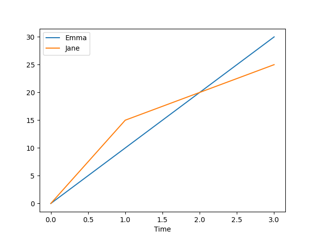
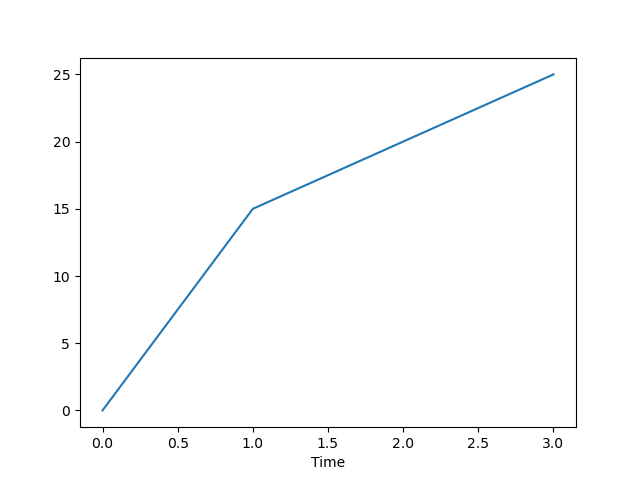
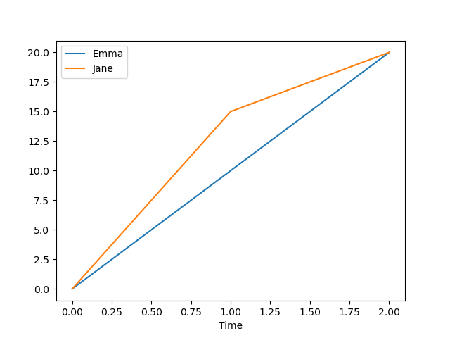
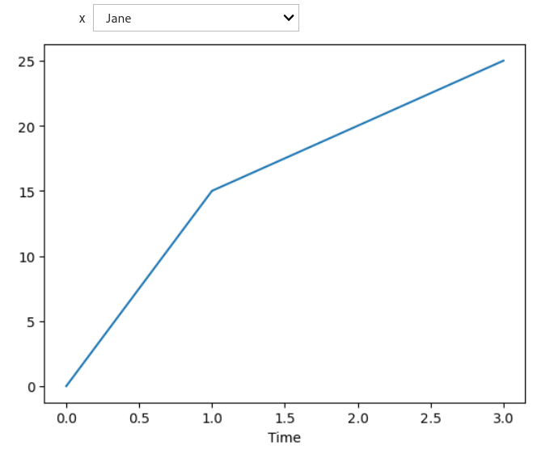
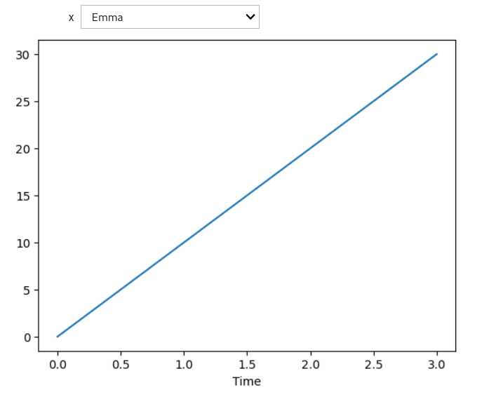

## Selecting and Plotting Subsets of (Tabular) Data

For the purpose of this simple demo, let us consider again a toy dataset
consisting of two tiny timeseries. Let us assume that we are tracking the
position of two runners, Emma and Jane.

~~~
import pandas as pd

time = [0, 1, 2, 3]
position = [0, 10, 20, 30]

table = pd.DataFrame({'Time': time, 'Emma': position})
table.set_index('Time', inplace=True)

# Create column for Jane's position
table['Jane'] = [0, 15, 20, 25]

print(table)
~~~
{: .language-python}
~~~
      Emma  Jane
Time
0        0     0
1       10    15
2       20    20
3       30    25
~~~
{: .output}

If we call the `plot` function (method) directly on the `pandas` dataframe, we
get a nice default style:

~~~
table.plot();
~~~
{: .language-python}

Indeed, we get a legend and an `xlabel`... for free! Here, we can see the
value of working with *labelled* data.

If we wanted to plot the position of a single runner, say, Jane, we would do
(see previous episode):

~~~
table['Jane'].plot();
~~~
{: .language-python}

If we wanted to plot the positions only up to a certain time point, say, up to
the third time point, we would do:

~~~
table[:3].plot();
~~~
{: .language-python}

## Selecting and Plotting them Interactively

[`ipywidgets`](https://ipywidgets.readthedocs.io/) is a library for exploring
code and data interactively. We import it as follows:

~~~
import ipywidgets as widgets
~~~
{: .language-python}

It provides a function, named `interact`, which allows us to create basic user
interface (UI) controls. For example, we may use a dropdown menu for
selecting the runner (Emma or Jane) whose position we want to visualize.
Likewise, we may use a slider for selecting the end value of the time points.

To begin with, we need to write a function where the parameter is the variable
we want to control (interact with). In the first case, this could be simply:

~~~
def f(x):
    table[x].plot();
~~~
{: .language-python}

Then, we need to call `interact` with this function as the first argument and
the variable to control as the second argument:

~~~
widgets.interact(f, x={'Emma', 'Jane'});
~~~
{: .language-python}

> ## Choosing Descriptive Function and Variable Names
>
> 1. Write a function to plot the timeseries up to a given time point.
> 2. What do you think about the names of your function and its parameter?
>
> > ## Solution
> >
> > 1. To plot the timeseries (which are the columns of dataframe `table`) up
> > to time point `xx`, we can use the following function:
> > ~~~
> > def ff(xx):
> >     table[:xx].plot();
> > ~~~
> > {: .language-python}
> >
> > Here we could have a discussion about whether `xx` is included or not: If
> > `xx` is a row index, it is excluded (as we have seen in episode 02 on
> > lists). If `xx` is an actual time value (timestamp), then it is included.
> >
> > 2. We have named this function `ff` because we already had a function
> > named `f` (this habit comes from a sub-culture in the R community). To
> > make the code easier to understand and maintain, it would be better to
> > name it, say, `truncate_timeseries`; likewise, the `xx` parameter could be
> > renamed into, say, `end_time`.
> {: .solution}
{: .challenge}

To create a slider, we pass the variable an integer:

~~~
widgets.interact(ff, xx=3);
~~~
{: .language-python}

We could combine both filters as follows:

~~~
def g(x, y):
    table[x][:y].plot();

widgets.interact(
    g,
    x={'Emma', 'Jane'},
    y=3
);
~~~
{: .language-python}

## Creating a Web App

Now that you have created an interactive data visualization, you may want to
share it with others, so they can get your point across and/or explore the
data by themselves. Instead of sharing your Jupyter notebook per se, you can
use *Voilà* to be able to share it as a web application:

* This is secure (prevents arbitrary code execution);
* This preserves interactivity (supports Jupyter widgets);
* This is accessible to non-technical users;
* This is highly customizable (e.g., with layout templates).

[`voila`](https://voila.readthedocs.io/) is a library for converting
(rendering) Jupyter notebooks into interactive dashboards.
Since we have `voila` installed in our environment, we can see a button with
the *Voilà* logo in the toolbar of our notebooks. Clicking this button takes
us to a `voila` web app served with the notebook server.

> ## Creating a Good-Looking Interactive Dashboard
>
> 1. Open a new notebook and create a Markdown cell: Write "Runners'
>    Dashboard" as a title.
> 2. Re-create the interactive plot with a dropdown menu which lets the user
>    visualize either Emma's or Jane's position over time. Maybe add markers
>    to the line and fix the lower and upper limits of the y-axis.
> 3. Render the notebook as a web app.
>
> > ## Solution
> >
> > 1. Using the dropdown menu in the toolbar, select "Markdown" to change the
> >    type of the first cell. Type `# Runners' Dashboard` in it.
> > 2. Create a second cell with the following code in it:
> > ~~~
> > import pandas as pd
> > import ipywidgets as widgets
> >
> > time = [0, 1, 2, 3]
> > position = [0, 10, 20, 30]
> >
> > table = pd.DataFrame({'Time': time, 'Emma': position})
> > table.set_index('Time', inplace=True)
> >
> > # Create column for Jane's position
> > table['Jane'] = [0, 15, 20, 25]
> >
> >
> > def select_runner(runner):
> >     table[runner].plot(
> >         marker='*',
> >         ylim=(0, 40)
> >     )
> >
> > widgets.interact(select_runner, runner={'Emma', 'Jane'});
> > ~~~
> > {: .language-python}
> >
> > You may need to call `help(table.plot)` to look up the documentation.
> >
> > 3. Click the *Voilà* button in the toolbar.
> {: .solution}
{: .challenge}

Alternatively, we can use `voila` to create a standalone web application. From
the terminal, we run `$ voila runner_dash.ipynb` to turn notebook
`runner_dash.ipynb` into a web app. Note that we don't launch nor run the
Jupyter notebook by ourselves. At this point, `voila` serves the app locally.

For your users or colleagues to access your web app via a network, you would
need to *deploy* your app. How to deploy your Voilà app is outside the scope
of this tutorial; if you would like to give it a try, please refer to the
`voila` [docs](https://voila.readthedocs.io/en/stable/deploy.html).
